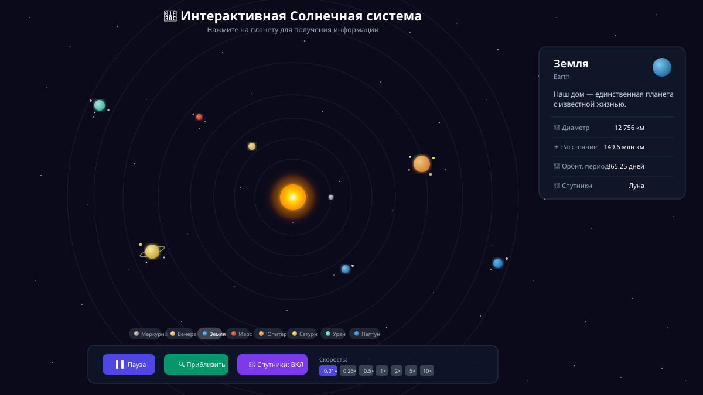

# 🌌 Интерактивная Солнечная система

Интерактивная обучающая демонстрация Солнечной системы, созданная с использованием React, TypeScript и Tailwind CSS.



## ✨ Возможности 

- **8 планет** с реалистичными относительными орбитальными скоростями
- **Спутники планет** — Луна, Фобос, Деймос, галилеевы спутники Юпитера, Титан и другие
- **Интерактивная информация** — нажмите на планету для просмотра характеристик
- **Управление воспроизведением** — пауза/воспроизведение
- **Регулятор скорости** — от 0.01× до 10×
- **Режим приближения (Zoom)** — фокус на выбранной планете с отслеживанием
- **Переключатель спутников** — включение/отключение отображения лун
- **Красивый космический дизайн** с анимированными звёздами

## 🚀 Быстрый старт

```bash
# Установка зависимостей
npm install

# Запуск dev-сервера
npm run dev

# Сборка для продакшена
npm run build
```

## 🪐 Планеты и их спутники

| Планета | Диаметр (км) | Расстояние (млн км) | Орбитальный период | Спутники |
|---------|-------------|---------------------|-------------------|----------|
| Меркурий | 4 879 | 57.9 | 88 дней | — |
| Венера | 12 104 | 108.2 | 225 дней | — |
| Земля | 12 756 | 149.6 | 365.25 дней | Луна |
| Марс | 6 792 | 227.9 | 687 дней | Фобос, Деймос |
| Юпитер | 142 984 | 778.6 | 11.86 лет | Ио, Европа, Ганимед, Каллисто |
| Сатурн | 120 536 | 1 433.5 | 29.46 лет | Титан, Рея, Энцелад |
| Уран | 51 118 | 2 872.5 | 84.01 лет | Титания, Оберон, Миранда |
| Нептун | 49 528 | 4 495.1 | 164.8 лет | Тритон, Нереида |

## 🎮 Управление

- **Клик по планете** — показывает информационную панель с характеристиками
- **Пауза/Старт** — останавливает или запускает анимацию
- **Приблизить/Отдалить** — зум к выбранной планете с автоматическим отслеживанием
- **Спутники ВКЛ/ВЫКЛ** — переключает отображение лун и их орбит
- **Скорость** — регулирует скорость анимации (0.01× — 10×)
- **Кнопки планет** — быстрый выбор планеты внизу экрана

## 🛠 Технологии

- **React 18** — UI-фреймворк
- **TypeScript** — типизация
- **Tailwind CSS** — стилизация
- **Vite** — сборщик
- **requestAnimationFrame** — плавная анимация 60 FPS

## 📐 Расчёт скоростей

Скорость анимации привязана к орбитальному периоду Земли:
- При `speed = 1×` Земля совершает **1 оборот за 60 секунд**
- Остальные планеты пересчитаны пропорционально их реальным орбитальным периодам
- Спутники используют относительные множители скорости

## 📄 Лицензия

MIT
